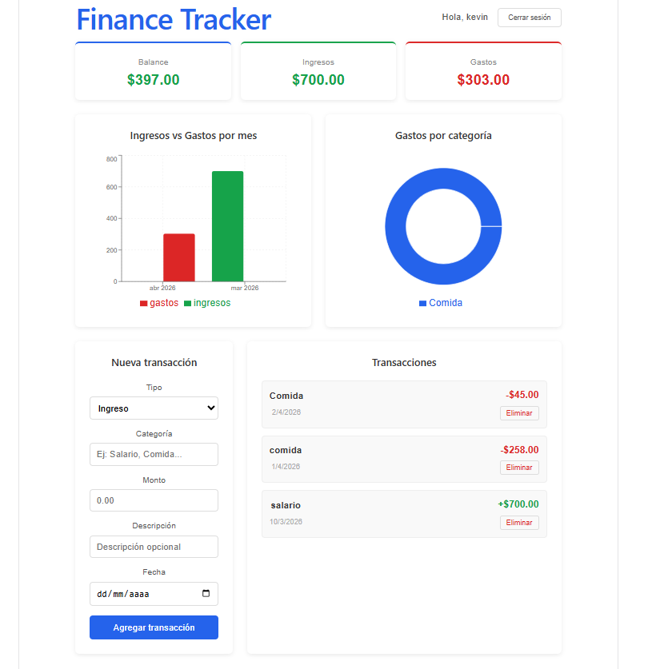

# Finance Tracker

Aplicación web de finanzas personales con autenticación, CRUD completo de transacciones y dashboard con gráficas interactivas.



## Demo

[https://finance-tracker-delta-sooty.vercel.app/](https://finance-tracker-delta-sooty.vercel.app/)

## Características

- Autenticación completa con JWT (registro e inicio de sesión)
- CRUD completo de transacciones (crear, leer, editar, eliminar)
- Dashboard con balance, ingresos y gastos en tiempo real
- Gráfica de barras: ingresos vs gastos por mes
- Gráfica de dona: distribución de gastos por categoría
- API REST propia con Node.js y Express
- Base de datos PostgreSQL

## Stack tecnológico

**Frontend:** React · Vite · React Router DOM · Axios · Recharts  
**Backend:** Node.js · Express · JWT · bcrypt  
**Base de datos:** PostgreSQL  
**Deploy:** Vercel (frontend) · Railway (backend + DB)

## Instalación local

### Prerrequisitos
- Node.js 18+
- PostgreSQL instalado localmente

### Backend

```bash
git clone https://github.com/Kevin30042001/finance-tracker-api.git
cd finance-tracker-api
npm install
cp .env.example .env
# Editar .env con tus credenciales de PostgreSQL
npm run dev
```

### Frontend

```bash
git clone https://github.com/Kevin30042001/finance-tracker.git
cd finance-tracker
npm install
npm run dev
```

### Variables de entorno — Backend

```env
PORT=3000
DB_HOST=localhost
DB_PORT=5432
DB_NAME=finance_tracker
DB_USER=postgres
DB_PASSWORD=tu_contraseña
JWT_SECRET=tu_clave_secreta
```

## Estructura del proyecto

### Backend
finance-tracker-api/
├── src/
│   ├── controllers/
│   │   ├── authController.js
│   │   └── transactionController.js
│   ├── routes/
│   │   ├── authRoutes.js
│   │   └── transactionRoutes.js
│   ├── middleware/
│   │   └── authMiddleware.js
│   ├── db/
│   │   └── index.js
│   └── index.js

### Frontend
finance-tracker/
├── src/
│   ├── components/
│   │   ├── BarChart.jsx
│   │   └── DonutChart.jsx
│   ├── context/
│   │   └── AuthContext.jsx
│   ├── pages/
│   │   ├── Login.jsx
│   │   ├── Register.jsx
│   │   └── Dashboard.jsx
│   ├── services/
│   │   └── api.js
│   └── App.jsx

## API Reference

| Método | Endpoint | Descripción | Auth |
|--------|----------|-------------|------|
| POST | /api/auth/register | Crear cuenta | No |
| POST | /api/auth/login | Iniciar sesión | No |
| GET | /api/transactions | Listar transacciones | Sí |
| POST | /api/transactions | Crear transacción | Sí |
| PUT | /api/transactions/:id | Editar transacción | Sí |
| DELETE | /api/transactions/:id | Eliminar transacción | Sí |
| GET | /api/transactions/summary | Resumen por categoría | Sí |

## Autor

**Kevin** — [@Kevin30042001](https://github.com/Kevin30042001)
